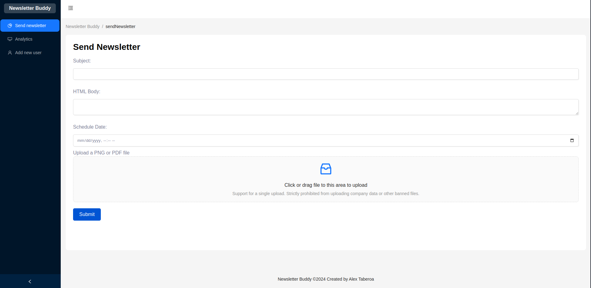
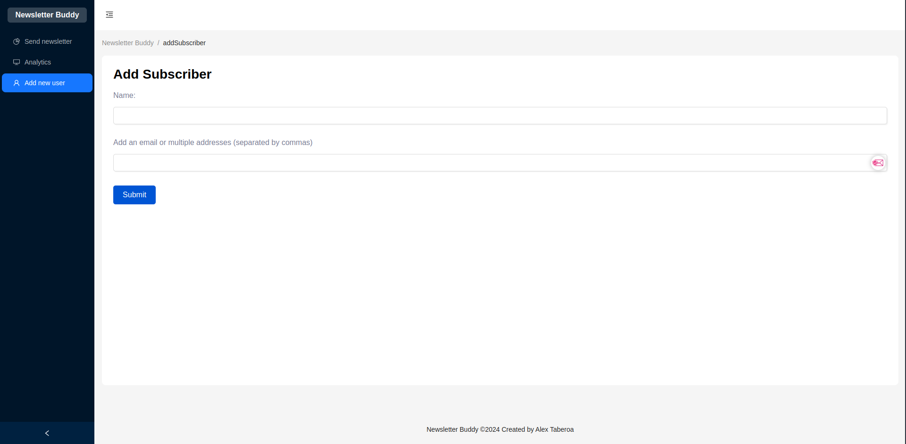
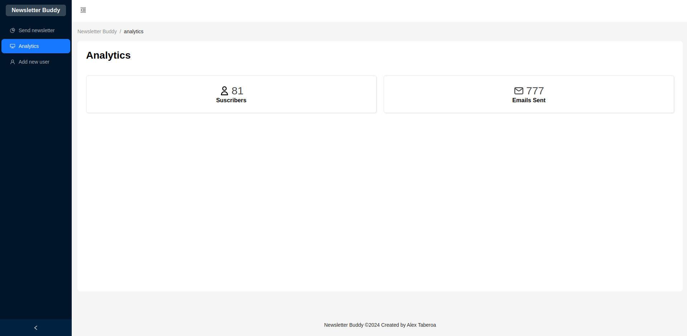
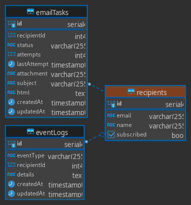

# Newsletter Buddy

Newsletter Buddy es una aplicación para el envío de boletines informativos. 

## Capturas:

## Estructura del proyecto

El proyecto consta de las siguientes partes:

-   Base de datos: PostgreSQL como sistema de gestión de bases de datos.
-   
-   Backend: Construido con Node.js, utilizando TypeScript como lenguaje de programación y Express como marco de aplicación web.
-   Frontend: Utiliza Preact como biblioteca de interfaz de usuario, Vite como herramienta de construcción y desarrollo, y pnpm como administrador de paquetes.

 ## Cómo ejecutar la aplicación

### Desarrollo

Dado que estamos vinculando volúmenes para cada servicio, es necesario acceder a los directorios para instalar las dependencias, ya que Docker no puede crear archivos en nuestro directorio (Opcional, hice esto para evitar problemas con los permisos de los archivos generados por los contenedores).

1. Clone este repositorio y cambie al directorio clonado.
2. Recuerda cambiar los valores de las variables de entorno de los .env de local en `docker/local` debes cambiar los valores de `backend.env`, `frontend.env` y `postgres.env` con tus propias credenciales.
3. Instale las dependencias del backend con los siguientes comandos:

- `docker-compose -f docker-compose.local.yml run --rm backend bash`
- `pnpm install` 
- `exit`

4. Instale las dependencias del frontend con los siguientes comandos:` 

- `docker-compose -f docker-compose.local.yml run --rm frontend bash` 
- `pnpm install` 
- `exit`

5. Ejecute todos los servicios juntos con:
- `docker compose -f docker-compose.local.yml up --build`

## Tecnologías utilizadas

- Base de datos: PostgreSQL
- Backend: Node.js, TypeScript, Express
- Frontend: Preact, Vite, pnpm

## Arquitectura

 La aplicación sigue una arquitectura típica de aplicaciones web modernas, que consta de un frontend construido con Preact, un backend construido con Node.js y TypeScript y una base de datos PostgreSQL. La aplicación se divide en componentes modulares y se utiliza una estructura de directorios clara para organizar el código fuente y los archivos de configuración. El uso de Docker y docker compose permite una fácil implementación y despliegue tanto en entornos de desarrollo como de producción. La configuración de Docker está organizada carpeta (`local`) dentro del directorio `docker`. Esto permite mantener separadas las configuraciones específicas del entorno y facilita el mantenimiento del proyecto.

La aplicación cuenta con las siguientes características principales:

1.  Permite al usuario administrador cargar un archivo PDF o PNG (el boletín).
2.  El usuario administrador puede enviar una lista de correo electrónico de los destinatarios del boletín.
3.  El usuario administrador puede agregar un solo correo electrónico a la lista de destinatarios.
4.  El usuario administrador puede agregar varios correos electrónicos a la lista de destinatarios.
5.  El usuario administrador puede hacer clic en un botón para activar el envío del boletín.
6.  El documento PDF o PNG se adjunta al correo electrónico.
7.  Los usuarios destinatarios pueden hacer clic en un enlace "darse de baja" contenido en el correo electrónico, y no deberían recibir más correos electrónicos.

## Resumen

Esta aplicación es una solución completa para la gestión y envío de boletines por correo electrónico. Utiliza tecnologías modernas y prácticas recomendadas para brindar una experiencia de usuario sólida y escalable. El uso de Docker y la estructura de directorios clara facilitan la implementación y el mantenimiento del proyecto.

Para obtener más información sobre cómo ejecutar y utilizar la aplicación, consulte las instrucciones de configuración y ejecución mencionadas anteriormente en este archivo README.
